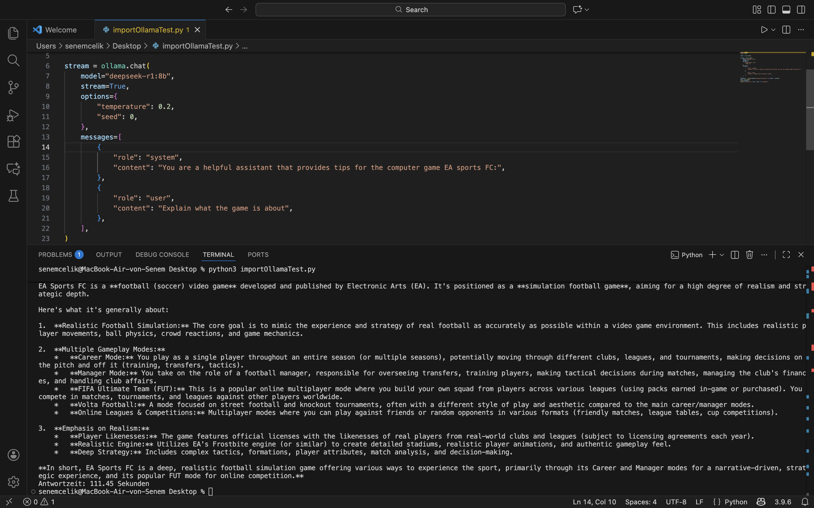
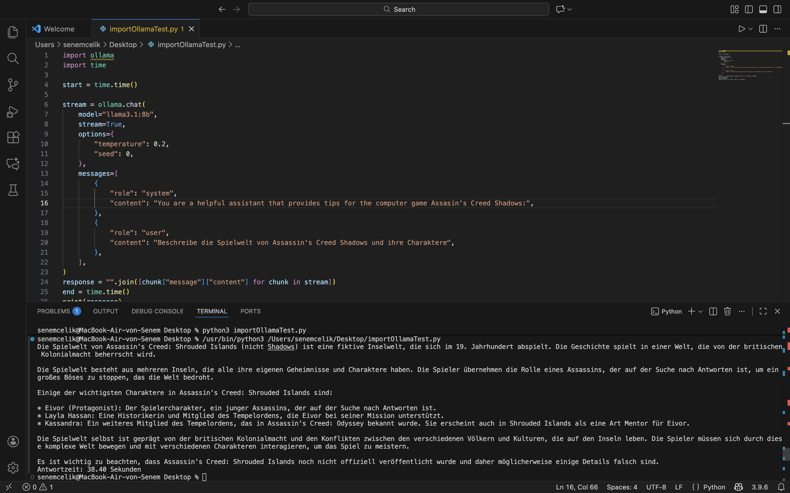

# Tipps zu verschiedenen Videospielen mit LLMs im Rahmen des Seminars: "Open LLMs in der Praxis"
Erstellt mit Python 3.14

## Beschreibung
Repository für ein OpenLLM Projekt, welches sich mit der Generierung von Tipps zu verschiedenen Videospielen beschäftigt.

Arbeitsschritte: 
- Prompts ausdenken/aussuchen und optimieren (Beide)
- Persönlicher Goldstandard (Senem) 
- System laufen lassen (Niklas)
- Ergebnisse evaluieren (Beide)

## Modelle
- [mistral:7b](https://ollama.com/library/mistral:7b) 
- [falcon3:7b](https://ollama.com/library/falcon3) -> Stand 28.11 1. im Open LLM Leaderboard bei Modellen bis zu 7 Milliarden Parametern 
- [llama3.1:8b](https://ollama.com/library/llama3.1:8b)
- [qwen2.5:7b](https://ollama.com/library/qwen2.5:7b)
- [deepseek-r1:8b](https://ollama.com/library/deepseek-r1:8b)

## Games
- Assassin's Creed Shadows
  - Action Adventure Spiel im Japan des 16. Jahrhunderts 
  - Machtkämpfe zwischen Fürsten 
  - Zwei Hauptfiguren: Naoe (Shinobi) und Yasuke (Samurai) 
  - Hauptfiguren tragen Konflikt zwischen Assassinen und Templern aus 
  - Vorgegebener Spielverlauf

- Assassin's Creed Origins
  - Action Adventure im antiken Ägypten 
  - Eine Hauptfigur: Bayek (Medjay = Nomadischer Krieger)
  - Hauptfigur rächt die Ermodrung seines Sohnes und gründet die Bruderschaft der Assassinen  
  - Vorgegebener Spielverlauf

- Minecraft
  - Welt, die aus Blöcken besteht und nach der eigenen Vorstellung gestaltet werden kann 
  - Verschiedene Modi: Überlebensmodus und Kreativmodus 
    - Überlebensmodus: Ressourcen müssen gesammelt werden und Spieler:innen kämpfen gegen Monster
    - Kreativmodus: Unbegrenzte Ressourcen und Spieler:innen könne sich frei durch die ganze Welt bewegen und werden nicht von Monstern angegriffen
    - Kein Vorgegebener Spielverlauf 

- EA Sports FC / Fifa
  - Sport-Simulationsspiel (Fußball) 
  - Spieler:innen können in verschiedenen Modi eigene Fußball-Turniere spielen 
    - Modi: Online-Modus, Karriere-Modus, Ultimate-Team, schnelle Spiele  
  - Gespielt wird mit existierenden Mannschaften aus der realen Welt 
  - Einzelne Spieler können gesteuert werden oder auch ganze Mannschaften

- Need for Speed
  - Auto-Rennspiel, in dem Rennen gefahren und Autos getuned werden können 
  - Inhalt variiert nach Spiel, Spielprinzip bleibt derselbe (Rennen gewinnen und Upgrades freischalten) 


## Erwartungen
- Passender Output relativ zum Spiel -> sinnvoll
- Unterschiedlicher aber hilfreicher Output -> unterschiedliche Schwerpunkte
- LLM passt sich an Spielsituationen an -> unterschiedlicher Spielerfortschritt
- LLM erkennt Erfahrungsgrad

## Prompts

### Rolle System:
```
    {
        "role": "system",
        "content": "Du bist ein hilfreicher Assistent, der wenn nötig Tipps für Videospiele geben kann:",
    },
```


### Spielübergreifende Prompts 
### Zielgruppenspezifische Prompts 
### Situationsbedingte Prompts 
Link zu den Prompts: https://docs.google.com/document/d/1fMDqfHUw0yT0HTISEm5VabPPTOkJ8DH3F__uapGrnPY/edit?usp=sharing

### Situationen
- Von Spiel abhängig
- Brenzlige Situationen -> unbedingte Hilfe nötig

### Zielgruppen
- Anfänger:in
- Erfahrene:r Spieler:innen
- verschiedene Konsolen
- Altersgruppen
  -> zB. Test, ob Kleinkind Tipps für GTA bekommt -> FSK unterschreitet

## Chats

## Ergebnisse
### Beispiel-Screenshots für deepseek-r1:8b und Llama3.1:8b
Deepseek:

Llama:


### [Assasins Creed: Shadows](https://docs.google.com/document/d/1e80PbVGQ1_RhQTtlTwsRTSMBhmZd-nRYsdCztk5WZu4/edit?usp=sharing)
### [Assasins Creed: Origins](https://docs.google.com/document/d/1v2reows3Iw11gAy1Z8Gv2Mdm9-62-73FYIq77fnmMHI/edit?usp=sharing)


### Bewertungskriterien

1. Korrektheit der Informationen

- *Stimmen die Tipps nachweislich mit dem Spielinhalt überein?*

2. Relevanz zum Spiel und zur Frage

- *Passt der Tipp konkret zum genannten Spiel, Modus, Level oder Problem?*

3. Praktischer Nutzen

- *Hilft der Tipp tatsächlich beim Weiterkommen?*
- *Ist er spielerisch umsetzbar und nicht nur theoretisch?*

4. Klarheit und Verständlichkeit

- *Ist der Tipp klar formuliert?*
- *Wird erklärt, wie man etwas machen soll?*

5. Fundierte Analyse

- *Geht der Tipp auf Spielmechaniken oder Gegnerverhalten ein?*

6. Anpassungsfähigkeit

- *Bezieht der Tipp mögliche Variationen ein (z. B. unterschiedliche Spielstile)?*
- *Wird der Kontext des Nutzers (z. B. Anfänger vs. Fortgeschrittener) berücksichtigt?*
- *Wird die Situation der Spieler:innen berücksichtigt?*
